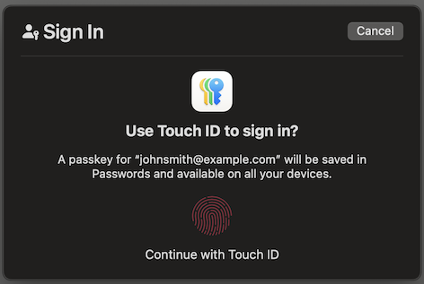

# WebAuthn Sample Web App

## Testing

	# Start the app
	npm run dev

# Notes
As mentioned in the [general README](../README.md), it is suggested that you remove password support entirely, and rely only on WebAuthn/Passkeys and/or Federated Logins.
Passwords are partially implemented here only to demonstrate using alternate authentication methods to add Passkeys.

# APIs without a sample UI

Other Passkey/WebAuthn APIs exist in the sample backend app that are not demonstrated in this sample web app.
This app only demonstrates registering and authenticating, not managing passkeys in other manners.

However, you will see functions in `webAuthn.ts` to invoke APIs to take those other actions via the sample backend app. For example:
- If you are logged in, but have not yet added a passkey to your account, you may use other authentication methods to add a passkey, such as password authentication.

`PasskeyControllerTest.java` also demonstrates usage of every API path. E.g.
- Add/edit passkey names
- Delete passkeys
- etc.

Main Screen:

Create Account with Passkey:

First Sign In:

Authenticate:

Lost Passkey:

Add Passkey from Emailed Link:

